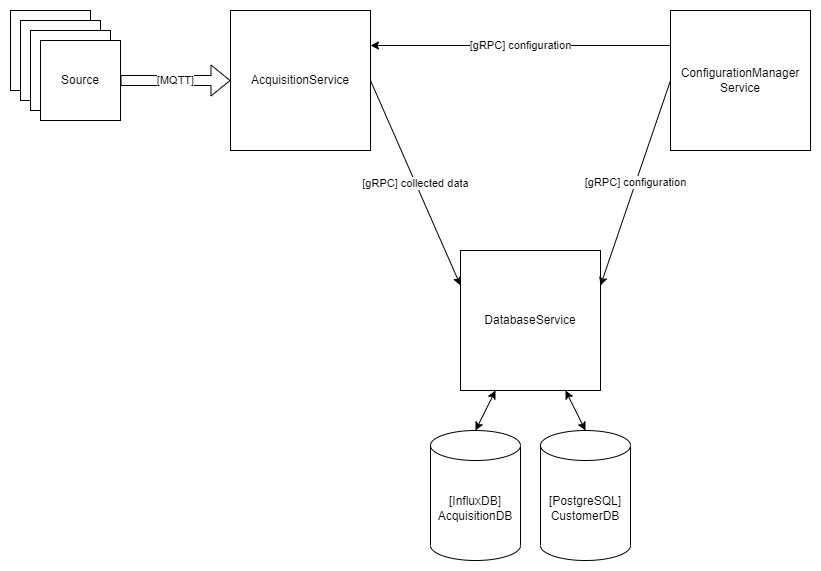

# Hermes

Hermes is a distributed data acquisition and storage system combined by different open-source technologies.

It has three main parts:

- Acquisition Service is responsible for collecting data (currently on MQTT) and send it to the Database Service via gRPC.

- Database Service receives the incoming data from the Acquisition Service and stores it in InfluxDB.

- Configuration Manager Service (coming soon) is a full-stack web application and has the privilege to configure the Acquisiton and Database Services via gRPC. From the UI user may allow multiple MQTT topics to listen on and add sensors by type. As the development goes customers could be added and paired with multiple sensors as owners.

## Demo
Coming soon...